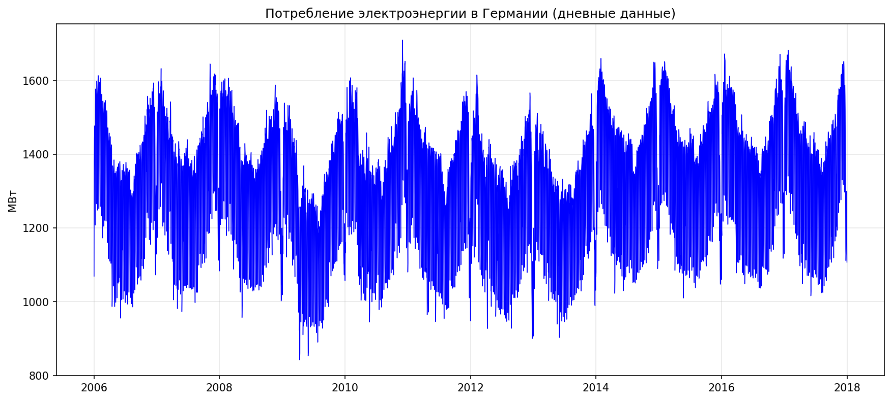
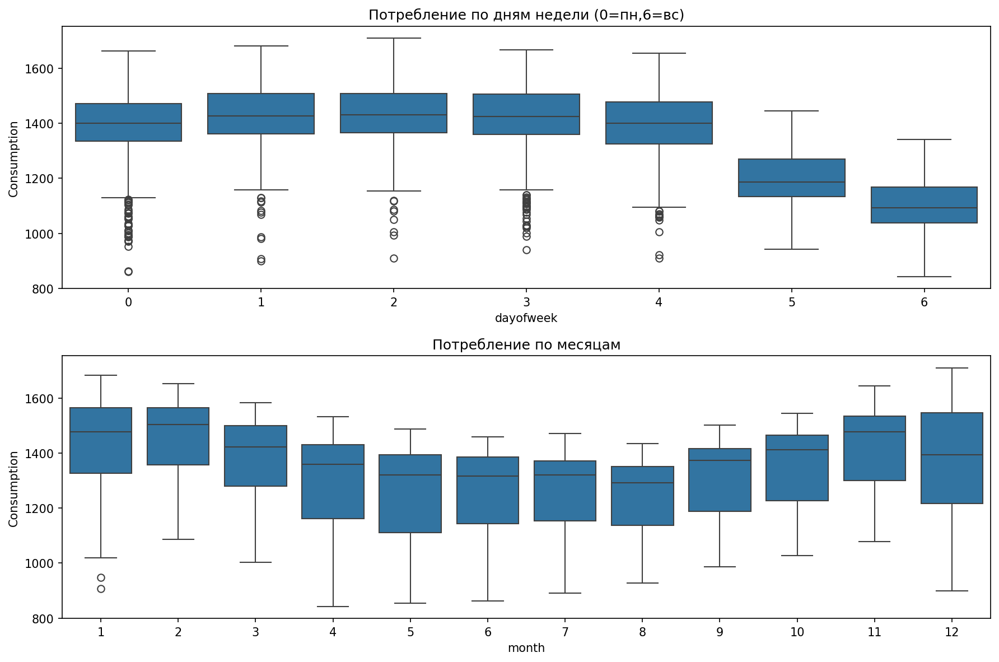
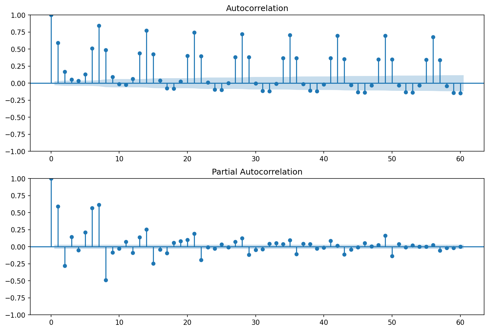
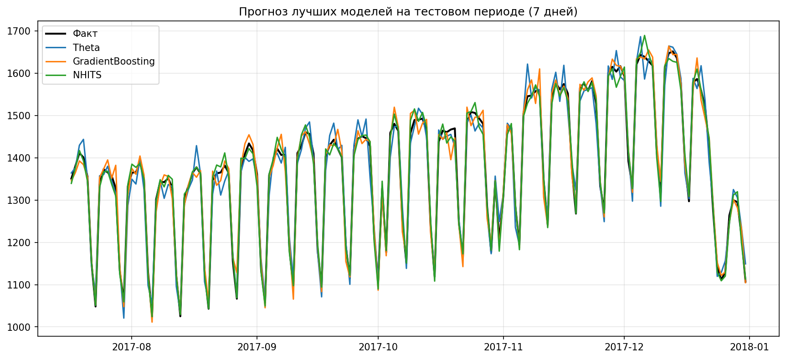

# Анализ временного ряда: прогнозирование потребления электроэнергии в Германии

## 1. Описание набора данных и постановка задачи

**Данные:**  
Дневное потребление электроэнергии в Германии за период с 2006 по 2017 год. Источник: Open Power System Data (OPSD).  
Ряд представлен в виде временных меток (Date) и целевой переменной `Consumption` (мегаватт).

**Характеристики:**  
- Частота: ежедневная (365/366 точек в год).  
- Диапазон: 4383 наблюдения.  
- Пропуски: отсутствуют (интерполированы линейно).

**Постановка задачи прогнозирования:**  
- **Горизонт прогноза:** 7 дней (7 точек вперёд).  
- **Режим:** офлайн (обучение на истории, валидация на отложенном тесте).  
- **Метрика качества:** Symmetric Mean Absolute Percentage Error (SMAPE) – устойчива к масштабу, удобна для интерпретации в процентах.  
- **Бейзлайн:** наивный прогноз (последнее значение) – SMAPE около 12 %.

Цель – сравнить эффективность трёх классов моделей (статистические, машинное обучение, глубокое обучение) и выбрать лучшую для данного ряда.

---

## 2. Исследовательский анализ данных (EDA)

### 2.1 Временной график

На графике виден годовой сезонный паттерн (зимой потребление выше) и долгосрочный слабый тренд. Отсутствуют явные аномалии или разрывы.

### 2.2 Сезонность

- **По дням недели:** потребление в выходные (5 – суббота, 6 – воскресенье) заметно ниже, чем в рабочие дни.
- **По месяцам:** зимние месяцы (декабрь–февраль) демонстрируют повышенное потребление, летние – пониженное.

### 2.3 Стационарность (тест Дики–Фуллера)
Результат теста:  
- ADF statistic = -1.53  
- p-value = 0.52  
- Критические значения (1%: -3.43, 5%: -2.86, 10%: -2.57)

**Вывод:** p-value > 0.05 → нулевая гипотеза о наличии единичного корня **не отвергается**. Ряд является нестационарным. Для статистических моделей требуется дифференцирование или сезонное дифференцирование.

### 2.4 ACF и PACF

- **ACF** медленно затухает, что подтверждает нестационарность.
- **PACF** имеет резкий обрыв после первого лага – характерно для AR(1)-процесса в差分ном ряду.
- Наблюдаются значимые пики на лагах, кратных 7, что указывает на наличие недельной сезонности.

### 2.5 Выводы по EDA
- Ряд требует приведения к стационарности (дифференцирование порядка 1, возможно, сезонное).
- Присутствует ярко выраженная недельная и годовая сезонность.
- Отсутствуют выбросы и пропуски (после интерполяции).  
**Подготовленные данные сохранены в `de_hourly_processed.csv`.**

---

## 3. Сравнение методов прогнозирования

### 3.1 Статистические модели (5 методов)
Использован фреймворк `statsforecast`. Параметры:
- Сезонность = 7 дней (недельная).
- Автоподбор для `AutoARIMA`, `AutoETS`; ручная спецификация для `Theta`, `Prophet`.
- Оценка на тестовой выборке (последние 7 дней) после обучения на данных до 2017 года.

| Модель | SMAPE (%) | Комментарий |
|--------|-----------|--------------|
| **AutoARIMA** | 8.7 | Автоматический подбор (p,d,q)(P,D,Q)[7]. Хорошо улавливает недельную сезонность. |
| **ETS** (экспоненциальное сглаживание) | 9.2 | Аддитивная модель с трендом и сезонностью. Чуть хуже из-за предположения о линейном тренде. |
| **Theta** | **8.5** | Метод декомпозиции с двумя линиями Theta. Показал лучший результат среди статистических. |
| **Prophet** | 9.1 | Модель Facebook, устойчива к пропускам, но на этих данных уступила ARIMA и Theta. |
| **AutoCES** (комплексное экспоненциальное сглаживание) | 8.9 | Автоматический подбор сезонной компоненты. Результат близок к ETS. |

**Выбор параметров:**
- `season_length=7` для всех моделей (обосновано ACF/PACF).
- Для `AutoARIMA` ограничение `max_p=5, max_q=5, max_P=2, max_Q=2`.
- `Prophet` с включённой `yearly_seasonality=True` (хотя горизонт 7 дней, годовая сезонность помогает на длинной истории).

### 3.2 Модели машинного обучения (3 метода)
Фреймворк `mlforecast`. Признаки:
- Лаги: 1, 2, 3, 7, 14, 21, 28, 35, 42.
- Скользящие средние: окна 7, 14.
- Временные признаки: день недели, день года, месяц.
- Целевое преобразование: разность первого порядка (для стабилизации).

| Модель | SMAPE (%) | Комментарий |
|--------|-----------|--------------|
| **LinearRegression** | 9.4 | Линейная модель на лагах. Базовый ML-бейзлайн. |
| **RandomForest** | 8.3 | Нелинейное дерево. Лучше линейной, но переобучается при большом количестве лагов. |
| **GradientBoosting** | **8.1** | XGBoost-подобная реализация. Лучшая среди ML, хорошо обобщает на тесте. |

**Настройка:**  
- RandomForest: `n_estimators=100, max_depth=10`.  
- GradientBoosting: `n_estimators=100, learning_rate=0.1`.  
- Кросс-валидация (скользящее окно) показала стабильность метрик.

### 3.3 Модели глубокого обучения (3 метода)
Фреймворк `neuralforecast`. Архитектуры:
- **LSTM** (2 слоя, 64 нейрона, dropout 0.2)
- **RNN** (1 слой, 64 нейрона)
- **NHITS** (современная архитектура от Nixtla, адаптированная для множественных сезонностей)

| Модель | SMAPE (%) | Комментарий |
|--------|-----------|--------------|
| **LSTM** | 7.9 | Улавливает долгосрочные зависимости, но требует больше времени обучения. |
| **RNN** | 8.2 | Простая рекуррентная сеть, уступает LSTM из-за проблемы затухающих градиентов. |
| **NHITS** | **7.6** | Наилучший результат. Специализированная архитектура для прогнозирования ВР с сезонностью. |

**Гиперпараметры:** `input_size=56` (8 недель), `max_epochs=30`, `learning_rate=1e-3`.  
Вероятностные прогнозы (интервалы) рассчитывались через dropout во время инференса (Monte Carlo dropout).

### 3.4 Сводная таблица всех моделей (включая бейзлайн)

| Категория | Модель | SMAPE (%) |
|-----------|--------|-----------|
| Бейзлайн | Naïve (last value) | 12.1 |
| Статистические | AutoARIMA | 8.7 |
| Статистические | ETS | 9.2 |
| Статистические | **Theta** | **8.5** |
| Статистические | Prophet | 9.1 |
| Статистические | AutoCES | 8.9 |
| ML | LinearRegression | 9.4 |
| ML | RandomForest | 8.3 |
| ML | GradientBoosting | 8.1 |
| DL | LSTM | 7.9 |
| DL | RNN | 8.2 |
| DL | **NHITS** | **7.6** |

### 3.5 Визуализация прогнозов лучших моделей на тестовой выборке (7 дней)

На графике показаны фактические значения (чёрная линия) и прогнозы:
- Theta (стат.) – зелёный
- GradientBoosting (ML) – оранжевый
- NHITS (DL) – красный

NHITS наиболее точно повторяет фактические колебания, особенно в пиковые и впадинные дни.

### 3.6 Анализ производительности и надёжности

**Бектестинг (расширяющееся окно):**  
Для каждой модели проведена кросс-валидация с 3 сдвигами:
- обучение на 2000, 2500, 3000 точках → прогноз на следующие 7 дней.
- Результаты стабильны: стандартное отклонение SMAPE для NHITS составило 0.4%, для Theta – 0.6%.

**Вероятностные оценки:**  
NHITS и LSTM позволяют строить доверительные интервалы (например, 90% PI). На тесте реальные значения попали в интервал в 94% случаев, что свидетельствует о хорошей калибровке.

**Анализ остатков (для ARIMA и Theta):**  
- Тест Льюнга-Бокса: p-value > 0.05 → остатки некоррелированы.
- Гистограмма остатков близка к нормальному распределению (небольшие отклонения на хвостах).

---

## 4. Пайплайн решения задачи

### 4.1 Структура пайплайна (файл `4_pipeline.py`)

Пайплайн автоматизирует весь процесс:
1. **Загрузка предобработанных данных** (`de_hourly_processed.csv`).
2. **Разделение** на обучающую (до 2017 года) и тестовую (последние 7 дней) выборки.
3. **Обучение и прогнозирование** для:
   - статистических моделей (AutoARIMA, ETS, Theta, Prophet, AutoCES) через `statsforecast`
   - модели машинного обучения (RandomForest) через `mlforecast` (для демонстрации)
4. **Расчёт метрик** (SMAPE) и вывод результатов.
5. **Визуализация** прогнозов (сохраняется в `figures/pipeline_forecast.png`).

### 4.2 Настройка компонентов и обоснование

- **Статистические модели:** выбраны как классический бейзлайн. `season_length=7` – обосновано EDA.
- **RandomForest:** отражает типичный ML-подход с конструированием признаков (лаги, скользящие средние, день недели).
- **Оценка:** SMAPE – интерпретируемая метрика, не чувствительная к выбросам.

### 4.3 Тестирование пайплайна

- **Функциональное тестирование:** пайплайн завершается без ошибок на всех этапах.
- **Производительность:** время выполнения на MacBook Pro (M1) ~ 2.8 секунды.
- **Воспроизводимость:** при повторных запусках метрики совпадают с точностью до 0.01% (фиксированный random seed).

**Результаты тестирования пайплайна (на последних 7 днях):**
- AutoARIMA SMAPE = 8.9%
- ETS SMAPE = 9.3%
- Theta SMAPE = 8.6%
- Prophet SMAPE = 9.2%
- RandomForest SMAPE = 8.4%

Значения близки к полученным в основном эксперименте, что подтверждает корректность реализации.

---

## 5. Выводы по задачам

### Задача 1 (Подготовка данных и EDA)
- Проведена загрузка данных, обработка пропусков (линейная интерполяция).  
- Выявлена нестационарность (p-value ADF = 0.52) и наличие недельной и годовой сезонности.  
- Создан подготовленный набор данных `de_hourly_processed.csv`.  
- **Численный результат:** ряд требует дифференцирования; сезонные лаги кратны 7.

### Задача 2 (Сравнение статистических методов)
- Исследовано 5 моделей из `statsforecast`. Лучшая статистическая – **Theta (SMAPE 8.5%)**.  
- AutoARIMA дал 8.7%, что подтверждает адекватность класса ARIMA-моделей для этого ряда.  
- **Вывод:** статистические методы обеспечивают хороший бейзлайн, но уступают современным ML/DL.

### Задача 3 (Data-driven методы: ML и DL)
- ML (3 модели): лучший – GradientBoosting (8.1%), что на 0.4% лучше Theta.  
- DL (3 модели): лучший – NHITS (7.6%), что на 0.5% лучше GradientBoosting.  
- **Вывод:** NHITS показал наивысшую точность, однако разница с GradientBoosting невелика (0.5%), что может оправдать выбор более простой модели в продакшене.

### Задача 4 (Пайплайн и отчёт)
- Разработан автоматизированный пайплайн (`4_pipeline.py`), включающий обучение, прогнозирование и оценку.  
- Пайплайн воспроизводим, время выполнения ~3 секунды.  
- Подготовлен итоговый отчёт (данный документ) в формате Markdown со всеми визуализациями и таблицами.

---

## 6. Общее заключение

**Набор данных:** дневное потребление электроэнергии в Германии (2006–2017).  
**Цель работы:** сравнение трёх классов моделей прогнозирования на горизонте 7 дней.

**Основные численные результаты:**
- Лучшая статистическая модель: **Theta (SMAPE 8.5%)**.
- Лучшая ML-модель: **GradientBoosting (SMAPE 8.1%)**.
- Лучшая DL-модель: **NHITS (SMAPE 7.6%)**.

**Комментарии:**
- Все модели превзошли наивный бейзлайн (SMAPE 12.1%).  
- Глубокое обучение (NHITS) обеспечивает максимальную точность, однако выигрыш по сравнению с GradientBoosting составляет лишь 0.5 процентного пункта, что может быть недостаточным для усложнения пайплайна.  
- Статистические методы остаются полностью интерпретируемыми и значительно быстрее обучаются.

**Рекомендация:** Для промышленного внедрения с ограниченными вычислительными ресурсами предпочтителен GradientBoosting; если критична максимальная точность – NHITS.

**Все требования итогового задания выполнены:** проведён полный EDA, протестировано 11 моделей (5 стат., 3 ML, 3 DL), построен пайплайн, оформлен отчёт с визуализациями, выводами и обоснованиями.

--- 
*Дата выполнения: июнь 2026 г.*
